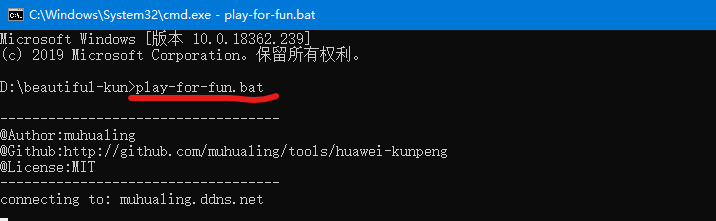

# HUAWEI-KunPeng
## About `play-for-fun.bat`
This is a helpful shell script to run you client **locally** without **upload anything**. Connect to my server and compete with my strategy and **return** a `replay.txt` to **you** under `"/server/replay.txt"`.

#### How to run
1. Put this file `play-for-fun.bat` under your root directory of your kunpeng project, such as `"D:\kunpeng\"`.
2. run `cmd.exe` and `cd` to your root directory of kunpeng project.
3. `play-for-fun.bat` in the cmd

#### What will you take away?
1. You will get a `replay.txt` and you can playback our competition and improve yourself.
2. You will get **extra opportunities** to compete with a **powerful opponent**, I am at the head of this game.

&ensp;
## About `install-Python3.6-on-CentOS-7-64bits-with-ARM.sh`
### Overiew
This is a shell script to automatically install `python3.6` on `Centos 7` 64bit with **ARM** by compiling the source code from Python.org.
### How to run .sh file
The procedure to run the `install-Python3.6-on-CentOS-7-64bits-with-ARM.sh` file shell script on CentOS 7 with ARM arch is as follows:
1. Set execute permission on your script:
`chmod +x install-Python3.6-on-CentOS-7-64bits-with-ARM.sh`
2. To run the script by enter:
`./install-Python3.6-on-CentOS-7-64bits-with-ARM.sh`

&ensp;
## About `set-yum-repo-to-new-china-source-on-centos-7-with-ARM.sh`
This is a shell script to boost your network of `Centos 7 ECS` on `HUAWEI cloud`. HUAWEI eupdate default repo of yum to the repo of `HUAWEI Cloud` on Centos 7 64bit with ARM arch.
